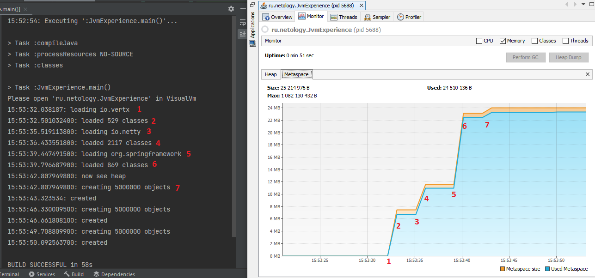

# Задача "Исследование JVM через VisualVM"

## Описание
Предлагаем вам изучить использование памяти через VisualVM при загрузке новых классов и создании новых объектов

## Инструкция
Скачайте и установите утилиту [VisualVM](https://visualvm.github.io/download.html).  
Откройте её и обратите внимание на раздел `Applications -> Local`  

Запульте и запустите проект [отсюда](https://github.com/Arsennikum/jvm-visualvm-experience).  
После запуска сразу же (у вас будет на это 30 сек, см. код) щелкните дважды по появившейся запущенной нашей программе в разделе `Local` (о котором упоминалось выше)  
Перейдите на вкладку `Monitor` и можете наблюдать метрики программы в реальном времени. Присмотритесь к разделам `Heap`, `Metaspace`

Когда программа завершится, изучите вывод консоли и код программы (в код можете не погружаться, главное - метод main). Соотнесите с графиками в разделах `Heap`, `Metaspace` и `Classes`  

Числовые значения в main методе можете менять по своему усмотрению в соответсвии с вашим железом и как вы считаете, будет показательно.  

Сделайте скриншоты графиков и отметьте на них с помощью простого графического редактора и текста, в какие моменты какие действия программы происходили.  
Для выполнения задания нужно отметить на таймлайне графиков каждую строку, которую вывела в консоль программа и пояснить её своими словами в тексте  
Данные скриншоты и текст отправьте в качестве домашнего задания (их также можно добавить в репозиторий. Для текста можете использовать формат Markdown)  

## Решение
После запуска метода main, начинается загрузка классов, используемых в методе loadToMetaspaceAllFrom.
###Рассмотрим использование Metaspace:

Загрузка начинается после задержки (1), потому что загрузка классов "ленивая", т.е. происходит в момент, когда данные классы используются.
После трех вызовов метода loadToMetaspaceAllFrom (1-2, 3-4, 5-6 на графике), вызывается метод createSimpleObjects и загружаются классы для его выполнения (7).
Размер Metaspace составил ~24Mb. 

###Рассмотрим использование Heap:

Сперва в куче создаются объекты, используемые в импортируемых библиотеках (7). Далее, на графике, видим результат вызовов метода createSimpleObjects (1-2, 3-4, 5-6), который создает объекты SimpleObject и резервирует под них место в heap. Голубая линия на графике отражает объем памяти, который ипользует наш код. Оранжевая - объем heap, зарезервированный jvm. Все понижения голубой линии на графике являются результатом работы сборщика мусора, который удаляет объекты, на которые нет ссылок, тем самым освобождая память.